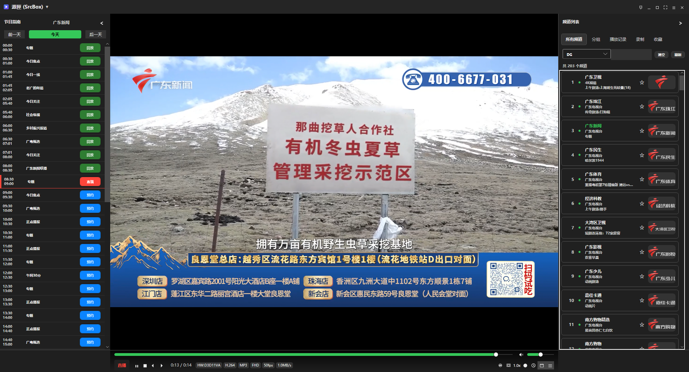
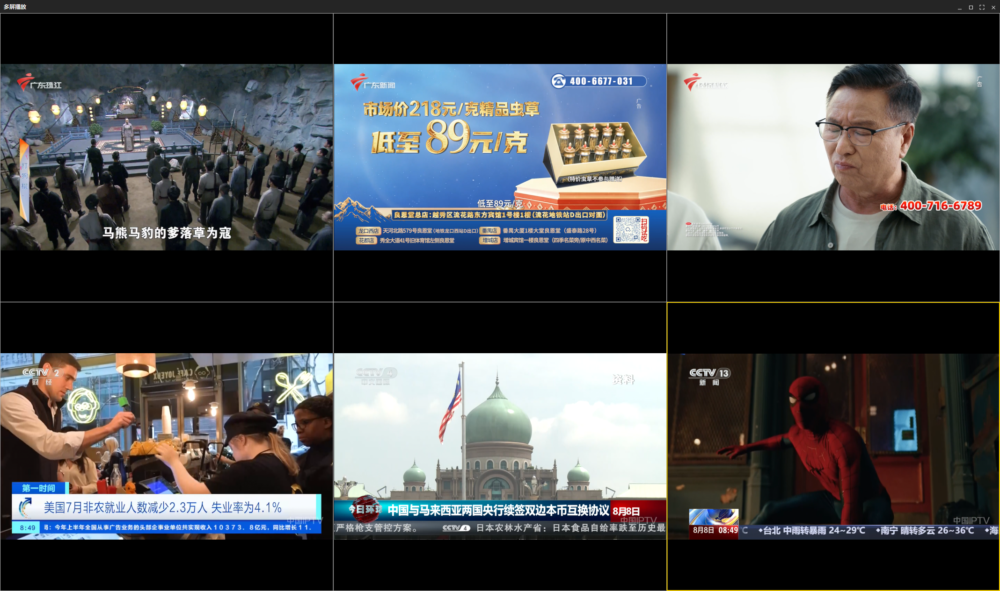
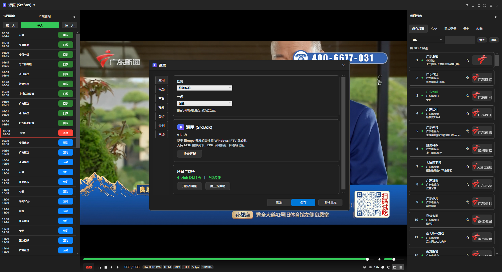

# 源匣（SrcBox）（Windows / WPF）

[](./LICENSE.txt)
[](https://dotnet.microsoft.com/)
[](https://www.microsoft.com/windows)
[](https://github.com/CGG888/SrcBox/releases/latest)
[](http://makeapullrequest.com)

[English](./README_EN.md) | [中文](./README.md)

**源匣（SrcBox）** 是一款专为 Windows 平台打造的高性能、现代化 IPTV 播放器。基于 **libmpv** 播放内核，结合 **WPF** 现代化界面，支持 M3U 播放列表、EPG 电子节目单、时移回看、预约录制、多屏播放、Web 远程控制等丰富功能。

[⬇️ 下载最新版本](https://github.com/CGG888/SrcBox/releases) | [📖 官方文档](https://srcbox.top) | [🐛 问题反馈](https://github.com/CGG888/SrcBox/issues)

---

> **免责声明**：
> 本页面展示的所有视频、截图及演示画面仅作**功能展示用途**，并非实际可播放或可用的媒体资源。**本项目不提供任何 m3u 播放列表文件及其中包含的频道数据**，亦不对第三方数据源负责。请遵守当地法律法规，使用合法播放源。

## 功能特性

| 功能 | 说明 |
|:---:|------|
| ⚡ **FCC 极速切台** | 毫秒级快速切台，告别传统 IPTV 的漫长等待 |
| 📺 **M3U + EPG** | 支持本地/远程 M3U 播放列表，完整 XMLTV 电子节目单 |
| ⏪ **时移与回看** | 实时拖动回看直播历史，模板自动生成回放链接 |
| 🎬 **预约录制** | 前台/后台双模式录制，WebDAV 云端同步 |
| 🖥️ **多屏播放** | 支持 4/6/9 屏幕同时观看，数字键快速切换 |
| 📱 **Web 远程控制** | 浏览器直接操控播放器，随时随地掌控电视 |
| 🔧 **硬件解码** | D3D11VA/DXVA2/NVDEC/软件多模式自动切换 |
| 📋 **频道管理** | 分组、搜索、收藏、历史，灵活的列表管理 |

## 系统需求 & 快捷键

| 系统需求 | |
|:---:|------|
| **操作系统** | Windows 10 / 11 (x64) |
| **运行环境** | .NET 8.0 SDK |
| **依赖库** | libmpv-2.dll（仓库根目录提供） |

| 常用快捷键 | |
|:---:|------|
| `Space` | 播放/暂停 |
| `Enter` | 全屏切换 |
| `↑↓` | 切换频道 |
| `E` | EPG 节目单 |
| `L` | 频道列表 |
| `R` | 开始/停止录制 |

## 最近更新 (v1.1.9)

- 🖥️ **多屏播放** - 4/6/9 屏幕同时观看，1-9 数字键快速选择
- 🎬 **预约录制** - 前台/后台双模式，录制完成 Toast 通知
- 🔧 **解码器选择** - 自动/D3D11VA/DXVA2/NVDEC/软件
- ⌨️ **快捷键帮助窗口** - 新增 ShortcutsWindow 快捷键说明
- ⚡ **时移增强** - 快进快退限制在节目边界内

[查看全部更新 →](https://github.com/CGG888/SrcBox/releases)

## 技术架构

| 层级 | 说明 |
|------|------|
| **UI 层** | WPF (ModernWpf) 现代化交互体验 |
| **架构层** | `Architecture/` 分层 (Application/Platform/Presentation) |
| **互操作层** | `MpvPlayer.cs` + `MpvPlayerEngineAdapter` 封装 libmpv |
| **服务层** | `M3UParser`、`EpgService`、`WebDAV` 等核心服务 |

## 快速开始

```powershell
# 编译
dotnet build

# 运行
dotnet run

# 测试
dotnet test .\Tests\LibmpvIptvClient.Tests.csproj
```

## 官方文档

| 语言 | 链接 |
|------|------|
| 简体中文 | [srcbox.top](https://srcbox.top) |
| 繁体中文 | [srcbox.top/zh-TW](https://srcbox.top/zh-TW) |
| English | [srcbox.top/en](https://srcbox.top/en) |
| Русский | [srcbox.top/ru](https://srcbox.top/ru) |

## 隐私与安全

- 所有配置、播放列表、EPG 缓存均存储于用户本地设备
- 网络请求仅在请求 M3U/EPG 地址、检查更新时发起

## 截图预览

- 主界面  
  

- 全屏悬浮控制条  
  

- 设置窗口  
  

---

## 开源许可

本项目基于 [MIT License](./LICENSE.txt) 开源。

## 致谢

- [libmpv](https://mpv.io/) - 强大的跨平台媒体播放引擎
- [ModernWpf](https://github.com/AngelSoyoso/ModernWpf) - WPF 现代化 UI 库
- [VitePress](https://vitepress.dev/) - 静态文档站点生成器
