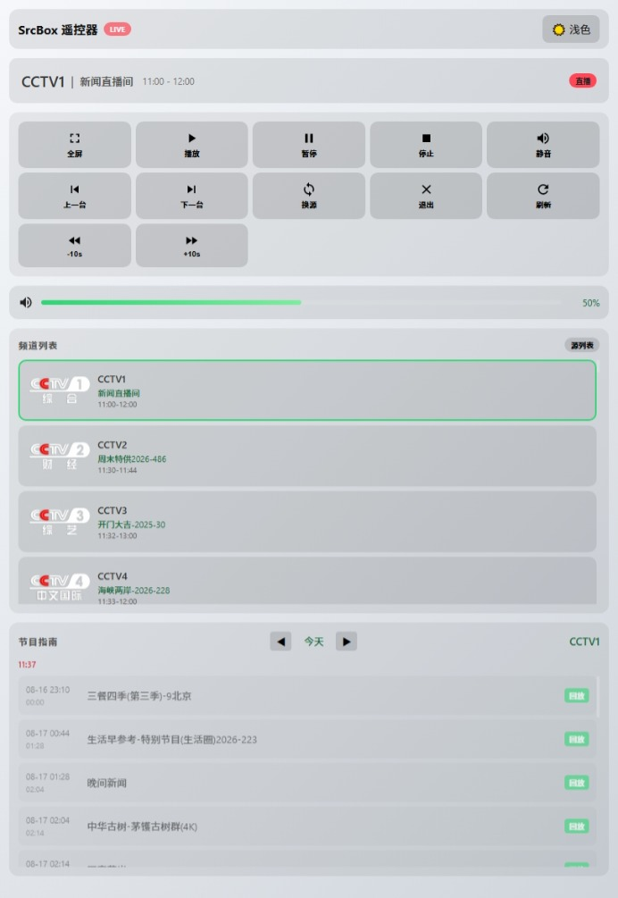

# Web Remote Control

SrcBox provides Web Remote Control functionality, allowing you to remotely control the player through a browser, including playback control, volume adjustment, channel switching, replay, scheduling recordings, and more.

## Features Overview

Web Remote is based on WebSocket and HTTP protocols, supporting the following features:

- **Playback Control**: Play, Pause, Stop
- **Progress Control**: Fast forward, Fast backward, Seek
- **Volume Control**: Volume adjustment, Mute
- **Channel Switching**: Previous/Next channel, Channel list, Channel search
- **Replay**: Timeshift replay, Program replay
- **Scheduling**: Reminder alerts, Scheduled recording (front/back)
- **Source Management**: Add, select, remove playback sources
- **Status View**: Current playback status, Program info, EPG guide
- **Multi-language Support**: Chinese, English, Russian, Turkish

## Enable Remote Control

1. Open SrcBox Settings window
2. Switch to **Web Remote** tab
3. Check **Enable Web Remote Control**
4. (Optional) Set access port (default 8899)
5. (Optional) Enable password protection, set access password
6. Click **Save** button

## Access Remote Control

After enabling, access in browser:

```
http://localhost:8899
```

For local access, use `localhost`. For LAN remote access, replace `localhost` with the IP address of the computer running SrcBox, for example:

```
http://192.168.1.100:8899
```

## Screenshot



## Interface Description

### Status Display Area

- Current playback mode (Live/Replay/Timeshift/Recording/Stopped)
- Current channel name and Logo
- Current program name and playback time

### Playback Control Area

| Button | Function |
|--------|----------|
| Fullscreen | Toggle fullscreen mode |
| Play | Start playback |
| Pause | Pause playback |
| Stop | Stop playback |
| Mute | Toggle mute |
| Previous Channel | Switch to previous channel |
| Next Channel | Switch to next channel |
| Switch Source | Switch playback source |
| Exit | Close player |
| Refresh | Refresh status data |

### Quick Control Area

| Button | Function |
|--------|----------|
| Timeshift | Toggle timeshift mode |
| -10s | Rewind 10 seconds |
| +10s | Forward 10 seconds |
| 0.5x | 0.5x playback speed |
| 1x | Normal speed |
| 2x | 2x playback speed |

### Volume Control Area

- Volume slider: Adjust volume level
- Mute button: Toggle mute

### Channel List

- Display all available channels and favorites
- Click channel name to switch playback
- Favorite channels displayed at top with star icon

### EPG Program Guide

- Display program list for current channel (shows today's programs by default)
- Click program to enter replay mode
- Three action buttons supported:
  - **Replay** (Purple): Replay aired program
  - **Timeshift** (Blue): Timeshift current program
  - **Reminder** (Green): Schedule reminder for future program
  - **Record** (Orange): Schedule front recording

### Program Badge说明

| Badge | Color | Meaning |
|-------|-------|---------|
| LIVE | Red | Currently live |
| Replay | Purple | Currently replaying |
| Reminder | Green | Reminder set |
| Next | Orange | Next program |

### Source Management (expandable)

- Display all saved playback sources
- Show source health status (Green=OK, Red=Failed)
- Support select, add, remove sources

### Reminder Management (expandable)

- Display all scheduled reminders
- Support cancel reminder
- Show channel, program name, time, action type

### Recording Management (expandable)

- Display all recording tasks
- Support stop in-progress recordings
- Support delete completed/failed recordings

## Security Settings

### Password Protection

After enabling password protection, access to the remote control page requires password:

1. Check **Require Password** in settings
2. Set access password
3. Save settings

Access requires password to use remote control functionality.

### Notes

- By default, remote control only allows local access (localhost)
- For LAN access, ensure firewall allows the corresponding port
- It is recommended to enable password protection for security
- After changing port, refresh the browser page

## WebSocket API Reference

In addition to browser interface operations, you can also programmatically control via the WebSocket API.

### Connection

```javascript
const ws = new WebSocket('ws://localhost:8899');
```

### Authentication (when password required)

```json
// Send
{ "action": "auth", "password": "your_password" }

// Receive
{ "success": true, "requireAuth": true }
```

### General Response Format

All operations return JSON response on success, or `{ "error": "error message" }` / `{ "success": false }` on failure.

### API List

#### Playback Control

| Action | Parameters | Description |
|--------|------------|-------------|
| `play` | - | Play/Resume playback |
| `pause` | - | Pause playback |
| `stop` | - | Stop playback |
| `volume` | `volume` (0-100) | Set volume |
| `fullscreen` | - | Toggle fullscreen |
| `seek` | `seconds` (+/- number) | Seek seconds |

#### Channel Control

| Action | Parameters | Description |
|--------|------------|-------------|
| `channel` | `channelId` | Switch channel |
| `prevChannel` | - | Previous channel |
| `nextChannel` | - | Next channel |

#### Speed Control

| Action | Parameters | Description |
|--------|------------|-------------|
| `setSpeed` | `speed` (0.5/1.0/2.0) | Set playback speed |
| `setTimeshift` | `enabled` (true/false) | Enable/disable timeshift |

#### Replay

| Action | Parameters | Description |
|--------|------------|-------------|
| `replayProgram` | `channelId`, `programTitle`, `start` (ISO), `end` (ISO) | Replay specified program |

#### Status Query

| Action | Returns | Description |
|--------|---------|-------------|
| `getStatus` | `{ playing, mode, channel, volume, ... }` | Get playback status |
| `getChannels` | `{ groups: [...], favorites: [...] }` | Get channel list |
| `getEpg` | `{ channelId, programs: [...] }` | Get program guide |
| `getSources` | `{ sources: [...] }` | Get source list |
| `getReminders` | `{ reminders: [...] }` | Get reminder list |
| `getRecordings` | `{ recordings: [...] }` | Get recording list |

#### Reminder Management

| Action | Parameters | Description |
|--------|------------|-------------|
| `addReminder` | `channelId`, `startAt` (ISO), `endTime` (ISO), `action`, `programTitle`, `preAlertSeconds`, `recordDurationMin` | Add reminder |
| `cancelReminder` | `id` | Cancel reminder |

#### Recording Management

| Action | Parameters | Description |
|--------|------------|-------------|
| `stopRecording` | `id` | Stop recording |
| `deleteRecording` | `id` | Delete recording |

#### Source Management

| Action | Parameters | Description |
|--------|------------|-------------|
| `selectSource` | `name` or `url` | Select source |
| `addSource` | `name`, `url` | Add source |
| `removeSource` | `name` or `url` | Remove source |
| `prevSource` | - | Previous source |
| `nextSource` | - | Next source |

#### Other

| Action | Parameters | Description |
|--------|------------|-------------|
| `exit` | - | Close player |
| `switchSource` | - | Switch source |

### Response Data Format

#### getStatus Response Example

```json
{
  "playing": true,
  "mode": "Replay",
  "modeText": "Replay",
  "channel": {
    "id": "CCTV1",
    "name": "CCTV1",
    "logo": "http://..."
  },
  "volume": 70,
  "muted": false,
  "speed": 1.0,
  "currentProgram": {
    "name": "Evening News",
    "start": "19:00",
    "end": "19:30",
    "isCurrent": true
  },
  "timeshiftEnabled": true,
  "timeshift": {
    "active": true,
    "cursor": "00:05:30",
    "range": "19:00 - 23:00"
  }
}
```

#### getEpg Response Example

```json
{
  "channelId": "CCTV1",
  "programs": [
    {
      "name": "News Broadcast",
      "start": "19:00",
      "end": "19:30",
      "startISO": "2026-08-16T11:00:00.000Z",
      "endISO": "2026-08-16T11:30:00.000Z",
      "isCurrent": true,
      "badge": "live",
      "badgeHtml": "<span class=\"epg-badge epg-badge-live\">LIVE</span>"
    }
  ]
}
```

## Troubleshooting

### Cannot Access Remote Control Page

1. Confirm Web Remote is enabled in settings
2. Check if port is occupied (default 8899)
3. Check firewall settings
4. Confirm SrcBox player is running

### Page Shows Blank

1. Try refreshing the page
2. Clear browser cache
3. Use another browser
4. Check if password protection is enabled

### Operations Not Responding

1. Confirm SrcBox player is playing
2. Check network connection
3. Try restarting SrcBox player

## Technical Implementation

Web Remote uses the following technologies:

- **WebSocket**: Real-time bidirectional communication for playback control commands
- **HTTP**: Status query and static resource services
- **JSON**: Data exchange format
- **Native HTML/CSS/JS**: No external dependencies

The server listens on port 8899 by default, and the Web interface is accessible through a browser without additional software.
